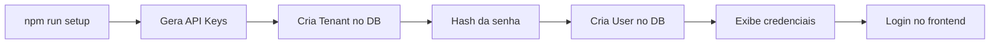

# Setup Script - Criação de Tenant e Usuário

Scripts para criar tenant e usuário inicial no sistema.

## 🚀 Setup Rápido (Tenant + Usuário)

Cria um tenant e um usuário admin com credenciais padrão:

```bash
npm run setup
```

### Credenciais Padrão

**Tenant:**
- Nome: Acme Corporation
- Slug: acme
- API Key: Gerada automaticamente

**Usuário Admin:**
- Email: admin@acme.com
- Senha: admin123
- Roles: tenant_admin, dept_admin, user
- API Key: Gerada automaticamente

### Customizar via Variáveis de Ambiente

```bash
# Customizar tenant
TENANT_NAME="Minha Empresa" \
TENANT_SLUG="minhaempresa" \
USER_EMAIL="admin@minhaempresa.com" \
USER_NAME="Administrador" \
USER_PASSWORD="senhasegura123" \
npm run setup
```

## 🎭 Dados de Demonstração

Cria 2 tenants e 3 usuários para teste:

```bash
npm run seed:demo
```

### O Que É Criado

**Tenant 1: Acme Corporation**
- 1 Admin (admin@acme.com / admin123)
- 1 Usuário Regular (user@acme.com / user123)

**Tenant 2: TechStart Inc**
- 1 Admin (admin@techstart.io / admin123)

Cada um com suas próprias API Keys.

## 🔑 Como Fazer Login

Após rodar o script, você pode fazer login de 3 formas:

### 1. Frontend (Recomendado)

Acesse: http://localhost (ou http://localhost:5173 em dev)

Cole a **User API Key** no campo de login.

### 2. API (Tenant Key)

```bash
curl -X POST http://localhost:3000/api/auth/token \
  -H "Content-Type: application/json" \
  -d '{
    "grantType": "api_key",
    "apiKey": "TENANT_API_KEY_AQUI"
  }'
```

### 3. API (User Key)

```bash
curl -X POST http://localhost:3000/api/auth/token \
  -H "Content-Type: application/json" \
  -d '{
    "grantType": "api_key",
    "apiKey": "USER_API_KEY_AQUI"
  }'
```

## 📝 Exemplo Completo

```bash
# 1. Instale dependências
npm install

# 2. Configure o banco
npm run prisma:generate
npm run prisma:migrate

# 3. Crie tenant e usuário
npm run setup

# 4. Copie a API Key exibida
# Exemplo: sk_a1b2c3d4e5f6...

# 5. Acesse o frontend
# http://localhost (ou http://localhost:5173)

# 6. Cole a API Key e faça login
```

## 🐳 Docker

Se estiver usando Docker:

```bash
# Rodar setup no container
docker-compose exec backend npm run setup

# Ou seed demo
docker-compose exec backend npm run seed:demo
```

## 📊 Verificar Dados Criados

Use o Prisma Studio para visualizar:

```bash
# Local
npm run prisma:studio

# Docker
docker-compose exec backend npx prisma studio
```

Acesse: http://localhost:5555

## 🔐 Segurança

**⚠️ IMPORTANTE:**

- As senhas padrão (`admin123`, `user123`) são apenas para desenvolvimento
- As API Keys são geradas com `crypto.randomBytes(32)`
- Em produção, sempre use senhas fortes e rotacione as API Keys
- Nunca commite `.env` com credenciais reais

## 🛠️ Scripts Disponíveis

| Script | Comando | Descrição |
|--------|---------|-----------|
| Setup | `npm run setup` | Cria 1 tenant + 1 usuário (customizável) |
| Demo | `npm run seed:demo` | Cria 2 tenants + 3 usuários (fixo) |

## 📁 Arquivos

```
scripts/
├── setup.ts       # Script principal (1 tenant + 1 user)
└── seed-demo.ts   # Dados de demonstração (múltiplos)
```

## 🔄 Fluxo Completo



## 💡 Dicas

1. **Primeira vez?** Use `npm run setup`
2. **Testando multi-tenant?** Use `npm run seed:demo`
3. **Customizar?** Use variáveis de ambiente
4. **Resetar?** Delete o banco e rode novamente

## 🐛 Troubleshooting

### "Tenant já existe"

Normal se você rodar o script múltiplas vezes. Ele mostra as credenciais do tenant existente.

### "User já existe"

Normal se o email já está cadastrado. Use outro email ou delete o usuário primeiro.

### Deletar tudo e recomeçar

```bash
# Local
npm run prisma:migrate reset

# Docker
docker-compose exec backend npx prisma migrate reset
```

## ✅ Checklist

- [ ] Banco de dados configurado
- [ ] Migrations rodadas
- [ ] Script de setup executado
- [ ] API Key copiada
- [ ] Login realizado com sucesso
- [ ] Credenciais salvas em lugar seguro

---

**Pronto para começar!** 🚀
